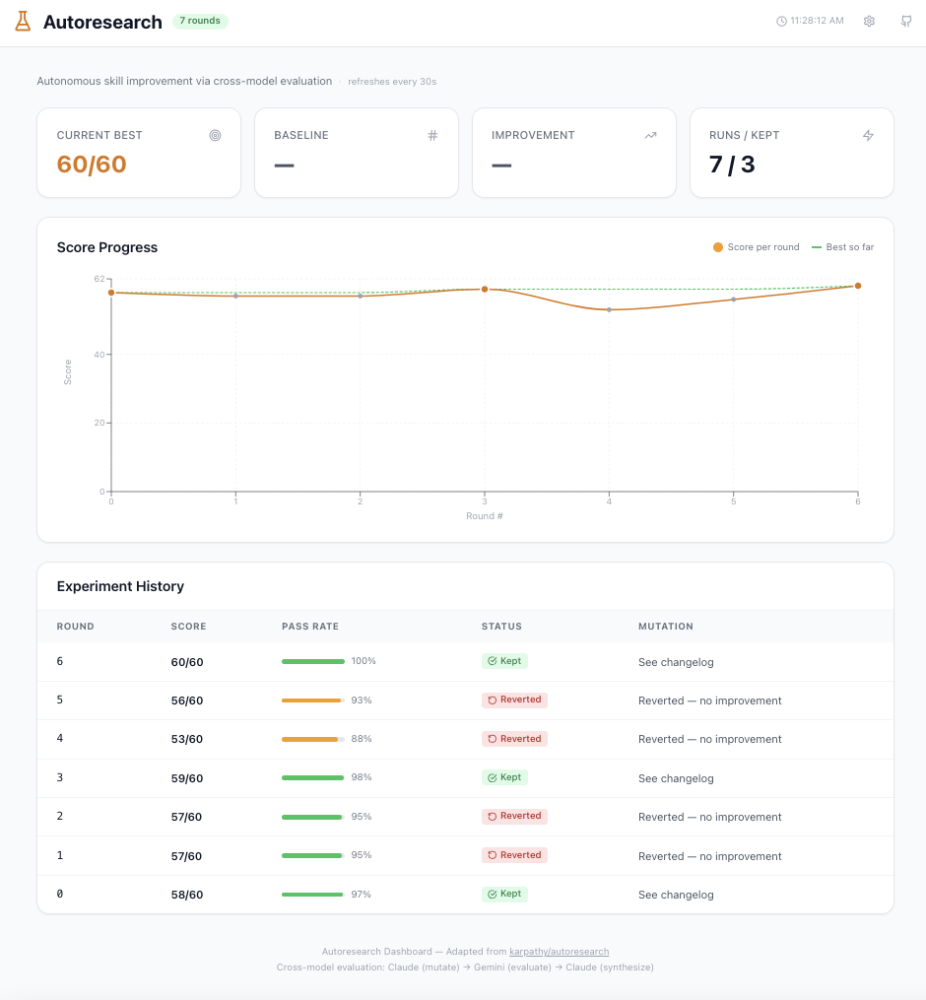

# Autoresearch for Claude Code Skills

This fork extends autoresearch beyond ML training to **autonomous skill prompt improvement** using a cross-model evaluation pipeline.



### The Idea

Claude Code skills are markdown prompt files. Like any prompt, they're noisy — sometimes they produce great output, sometimes garbage. Autoresearch fixes this by iteratively mutating the prompt, evaluating outputs, keeping improvements, and discarding regressions. The same loop Karpathy uses for `train.py`, applied to `SKILL.md`.

The twist: we use **Gemini as an independent evaluator** (the "naked reasoner") to eliminate self-grading bias. Claude proposes mutations, Claude generates outputs, but Gemini scores them — with zero knowledge of what was changed.

### How It Maps

| Autoresearch (nanoGPT) | This Fork (Skills) |
|------------------------|-------------------|
| `train.py` — the thing being optimized | `SKILL.md` — the prompt being improved |
| `program.md` — agent instructions | `skills/program.md` — improvement loop instructions |
| `prepare.py` — data prep (ML-specific) | N/A — not needed for skills |
| `val_bpb` — validation metric | `eval_pass_rate` — binary criteria across N runs |
| Single model (agent edits + evaluates) | **Cross-model**: Claude mutates, Gemini evaluates |

### Quick Start

```bash
# 1. Set up credentials
echo "YOUR_GEMINI_KEY" > ~/.claude/.credentials/gemini-api-key.txt
echo "YOUR_ANTHROPIC_KEY" > ~/.claude/.credentials/anthropic-api-key.txt

# 2. Install dashboard
cd dashboard && npm install

# 3. Run autoresearch on a skill
node skills/autoresearch-runner.mjs --skill system-self-correction-v2 --continuous --dashboard-sync

# 4. View live dashboard (in another terminal)
cd dashboard && npm run dev
# → http://localhost:4100

# 5. Or use terminal dashboard
node skills/autoresearch-runner.mjs --skill deep-plan-v2 --continuous --tui
```

### Terminal Dashboard

Run with `--tui` for a live-updating ASCII dashboard in your terminal:

```
  ⚗  Autoresearch  LIVE  ─ deep-plan-v2
  Autonomous skill improvement via cross-model evaluation
  Claude (mutate) → Gemini (evaluate) → Claude (synthesize)

  ┌──────────────┬──────────────┬──────────────┬──────────────┐
  │ CURRENT BEST │ BASELINE     │ IMPROVEMENT  │ RUNS / KEPT  │
  │ 60/60        │ 58/60        │ +3.4%        │ 7 / 3        │
  └──────────────┴──────────────┴──────────────┴──────────────┘

  Score Progress    ● kept  ○ reverted

   62 │
   60 │     ●                 ●                 ●
   58 │           ○     ○
   56 │                                   ○
   53 │                             ○
      └───────────────────────────────────────────▸ Round

  Experiment History
  ROUND  SCORE    RATE   STATUS      MUTATION
  ─────────────────────────────────────────────────────────────────
  6      60/60    100%   kept        Added proportionality check
  5      56/60    93%    reverted    Restructured phases — regressed
  4      53/60    88%    reverted    Added explicit examples — too narrow
  3      59/60    98%    kept        Reworded footgun audit patterns
  2      57/60    95%    reverted    Reverted — no improvement
  1      57/60    95%    reverted    Reverted — no improvement
  0      58/60    97%    baseline    Original SKILL.md
```

### Web Dashboard

Features:
- **Metric cards**: Current Best, Baseline, Improvement %, Runs/Kept
- **Recharts line chart**: Score progress with best-so-far overlay
- **Experiment table**: Status badges, pass rate bars, mutation descriptions
- **Auto-refresh**: Polls `results.json` every 30 seconds
- **Configurable**: Point at any `results.json` URL via settings panel

### Cross-Model Evaluation (in autoresearch)

```
Claude (mutator)    → proposes SKILL.md mutations based on failure analysis
Claude (runner)     → generates outputs against 10 test scenarios
Gemini (evaluator)  → independently scores outputs (no mutation context = no bias)
Claude (synthesizer)→ combines scores, decides keep/revert, plans next mutation
```

**Why Gemini as evaluator?** When Claude both mutates and evaluates, it's the student grading their own test. Gemini gets ONLY the outputs and the rubric — no changelog, no mutation rationale. It can't be biased by knowing what was changed. This adds ~$0.03/round but removes self-grading bias entirely.

### Cross-Model Reasoning Pipeline (standalone tool)

This repo also includes a **separate, independent** tool: the [Cross-Model Reasoning Pipeline](reasoning-pipeline/). It uses the same Claude→Gemini→Claude architecture but for a completely different job — analyzing content (transcripts, articles, decisions) and producing validated action plans.

```bash
# Analyze a video transcript through 3 models
node reasoning-pipeline/pipeline.mjs \
  --transcript my-talk-notes.md \
  --context my-project.md

# Output: 70-100K of validated, executable plans
```

See [`reasoning-pipeline/README.md`](reasoning-pipeline/README.md) for the full walkthrough, use cases, and examples.

**These are independent tools:**
- **Autoresearch runner** → iterative prompt improvement loop (runs continuously)
- **Reasoning pipeline** → one-shot content analysis (runs once per content piece)
- Both use Gemini as an independent reasoner, but for different purposes

### Eval Design

Follow these rules from the [autoresearch video transcript](docs/):

1. **Binary yes/no** — "Does the output contain X?" Only two possible answers.
2. **Avoid Likert scales** — 1-7 ratings compound variability.
3. **Don't over-specify** — Too many narrow constraints → model "teaches to the test."
4. **Few, meaningful, principle-based** — 4-6 criteria per skill.
5. **Run many times** — 10 outputs per round to account for prompt noise.

### Results

| Skill | Baseline | Final | Rounds | Key Mutation |
|-------|----------|-------|--------|-------------|
| `system-self-correction-v2` | 56/60 | 60/60 | 2 | Added severity levels + Defer action to quality gate |
| `deep-plan-v2` | 58/60 | 60/60 | 7 | Added proportionality check for trivial tasks |

### CLI Reference

```bash
node skills/autoresearch-runner.mjs [options]

Options:
  --skill <name>        Target skill (default: system-self-correction-v2)
  --rounds <n>          Number of rounds to run (default: 1)
  --continuous          Run until target reached or stuck (max 100 rounds)
  --dashboard-sync      Write results to dashboard/public/results.json
  --tui                 Show live terminal dashboard after each round
```

### Project Structure

```
skills/                              ── Autoresearch skill improvement loop
  autoresearch-runner.mjs            — Cross-model improvement engine
  program.md                         — Agent instructions for the loop
  working-<skill>/                   — Per-skill working directory
    SKILL.md                         — Current (mutated) version
    SKILL.md.baseline                — Original (never modified)
    results.tsv                      — Experiment log
    changelog.md                     — Mutation history

reasoning-pipeline/                  ── Standalone cross-model reasoning tool
  pipeline.mjs                       — 3-stage Claude→Gemini→Claude pipeline
  README.md                          — Full walkthrough with use cases

dashboard/                           ── Live monitoring web dashboard
  src/App.jsx                        — Standalone React app
  public/results.json                — Data file (synced by runner)
  package.json                       — React + Vite + Tailwind + Recharts
```

## License

MIT
